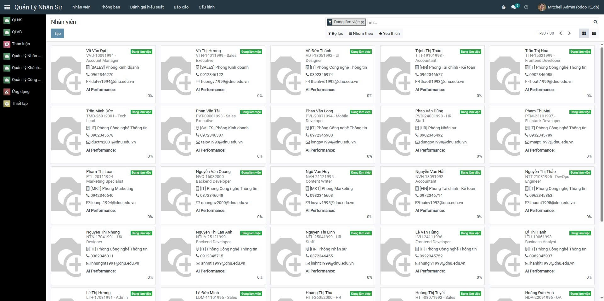
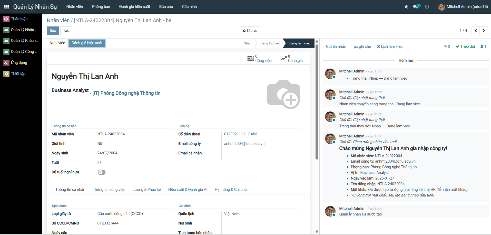
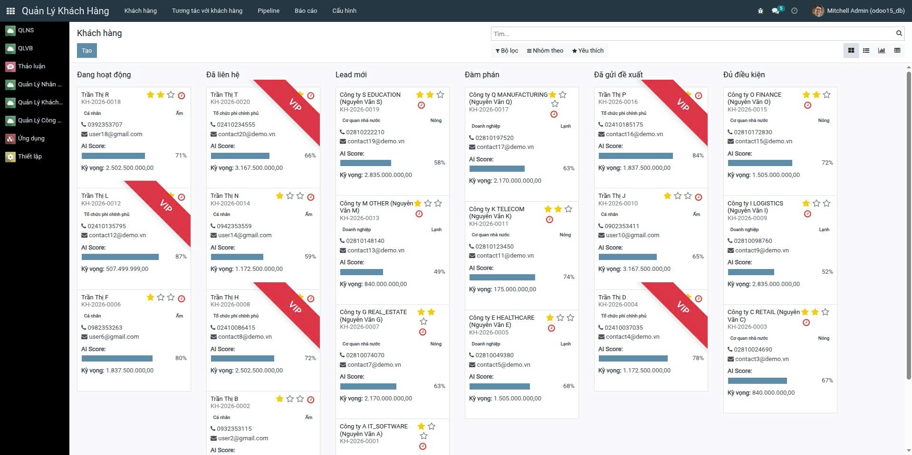
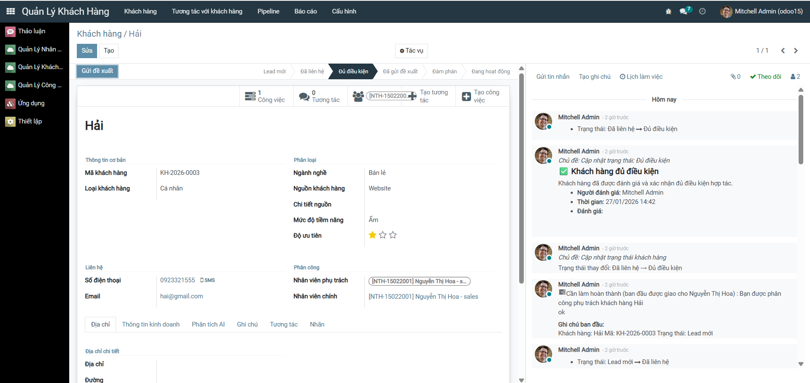
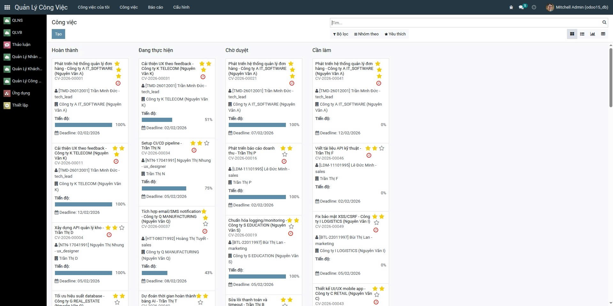
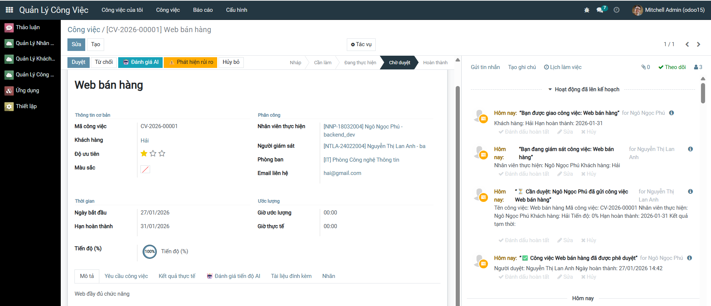
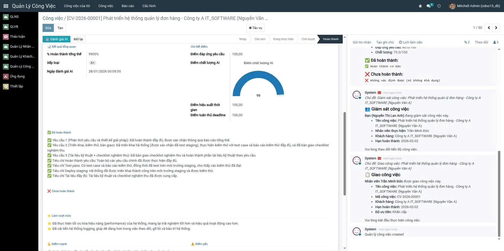

<h2 align="center">
    <a href="https://dainam.edu.vn/vi/khoa-cong-nghe-thong-tin">
    🎓 Faculty of Information Technology (DaiNam University)
    </a>
</h2>
<h2 align="center">
    PLATFORM ERP
</h2>
<div align="center">
    <p align="center">
        
        
        
    </p>

[](https://www.facebook.com/DNUAIoTLab)
[](https://dainam.edu.vn/vi/khoa-cong-nghe-thong-tin)
[](https://dainam.edu.vn)

</div>

## 📖 1. Giới thiệu

Hệ thống **Quản Lý Doanh Nghiệp Tích Hợp AI** được xây dựng trên nền tảng Odoo 15, phục vụ cho học phần Thực tập doanh nghiệp. Hệ thống cung cấp các chức năng quản lý toàn diện từ khách hàng, công việc đến nhân sự, với tích hợp AI để đánh giá hiệu suất tự động.

### 🎯 Tính năng chính

#### 📋 Module Quản Lý Khách Hàng (`quan_ly_khach_hang`)
- **Workflow quản lý khách hàng**: Lead → Đã liên hệ → Đủ điều kiện → Đã gửi đề xuất → Đàm phán → Đang hoạt động → Hoàn thành
- **Wizard forms**: Mỗi bước chuyển trạng thái yêu cầu form riêng với validation và bằng chứng (file đính kèm, ghi chú)
- **Tương tác với khách hàng**: Ghi nhận các tương tác (gọi điện, email, hẹn gặp, thăm khách hàng) với đầy đủ thông tin
- **Tracking đầy đủ**: Lịch sử workflow, ai làm gì, khi nào, có bằng chứng gì
- **Liên kết tự động**: Tự động tạo công việc từ tương tác với khách hàng
  <p align="center">
        
        
    </p>

#### 📝 Module Quản Lý Công Việc (`quan_ly_cong_viec`)
- **Workflow quản lý công việc**: Nháp → Cần làm → Đang thực hiện → Chờ duyệt → Hoàn thành
- **Wizard forms**: Bắt đầu, gửi duyệt, duyệt công việc đều có form riêng với validation
- **Yêu cầu bằng chứng**: File kết quả bắt buộc khi gửi duyệt, ghi chú chi tiết
- **AI đánh giá tự động**:
  - Đánh giá tiến độ khi gửi duyệt (phát hiện rủi ro trễ hạn, mức độ hoàn thành)
  - Đánh giá chất lượng khi duyệt (điểm chất lượng 0-100, xếp loại A+/A/B/C/D/F)
- **Tự động đánh giá hiệu suất nhân viên**: Khi công việc hoàn thành, tự động cập nhật thống kê và điểm AI cho nhân viên
- **Email thông báo tự động**: Gửi email cho nhân viên và giám sát ở các bước quan trọng
<p align="center">
        
        
    </p>

#### 👥 Module Quản Lý Nhân Sự (`quan_ly_nhan_su`)
- **Quản lý thông tin nhân viên**: Thông tin cá nhân, công việc, lương & phúc lợi
- **AI đánh giá hiệu suất tự động**:
  - Điểm hiệu suất tổng thể (0-100) dựa trên: Tỷ lệ hoàn thành (30%), Giao việc đúng hạn (25%), Chất lượng (20%), Phù hợp kỹ năng (15%), Xu hướng phát triển (10%)
  - Mức hiệu suất: Poor / Below Average / Average / Good / Excellent / Outstanding
  - Phân tích điểm mạnh, điểm cần cải thiện, khuyến nghị phát triển
- **Lịch sử đánh giá AI**: Lưu trữ lịch sử đánh giá chi tiết với biểu đồ xu hướng
- **Biểu đồ thống kê**: Visualize hiệu suất nhân viên qua thời gian
<p align="center">
        
        
    </p

### 🤖 Tích hợp AI (Google Gemini API)
- **AI Service**: Tích hợp Google Gemini API với API key rotation và retry mechanism
- **Đánh giá tiến độ công việc**: Phân tích nguy cơ trễ hạn, mức độ hoàn thành
- **Đánh giá chất lượng công việc**: So sánh yêu cầu vs kết quả, tính điểm chất lượng
- **Đánh giá hiệu suất nhân viên**: Phân tích tổng thể dựa trên thống kê công việc
<p align="center">
        
    </p

### 🔒 Tính năng bảo mật & Validation
- **Không thể bypass workflow**: Statusbar không thể click trực tiếp, phải qua wizard forms
- **Validation đầy đủ**: Mỗi bước yêu cầu thông tin và bằng chứng cụ thể
- **Tracking minh bạch**: Ghi nhận đầy đủ ai làm gì, khi nào, có bằng chứng gì
- **Access rights**: Phân quyền rõ ràng cho từng module

### 📊 Báo cáo & Thống kê
- **Báo cáo công việc**: Thống kê công việc theo nhân viên, phòng ban, khách hàng
- **Biểu đồ hiệu suất**: Visualize hiệu suất nhân viên qua thời gian
- **Lịch sử workflow**: Xem đầy đủ lịch sử thay đổi trạng thái 

## 🔧 2. Các công nghệ được sử dụng
<div align="center">

### Hệ điều hành
[](https://ubuntu.com/)
### Công nghệ chính
[](https://www.odoo.com/)
[](https://www.python.org/)
[](https://developer.mozilla.org/en-US/docs/Web/JavaScript)
[](https://www.w3.org/XML/)
### Cơ sở dữ liệu
[](https://www.postgresql.org/)
</div>

## 🚀 3. Các project đã thực hiện dựa trên Platform

Một số project sinh viên đã thực hiện:
- #### [Khoá 15](./docs/projects/K15/README.md)
- #### [Khoá 16]() (Coming soon)
## ⚙️ 4. Cài đặt

### 4.1. Cài đặt công cụ, môi trường và các thư viện cần thiết

#### 4.1.1. Tải project
```bash
git clone https://github.com/FIT-DNU/Business-Internship.git
cd Business-Internship
```

#### 4.1.2. Cài đặt các thư viện cần thiết
```bash
sudo apt-get install libxml2-dev libxslt-dev libldap2-dev libsasl2-dev libssl-dev python3.10-distutils python3.10-dev build-essential libssl-dev libffi-dev zlib1g-dev python3.10-venv libpq-dev
```

#### 4.1.3. Khởi tạo môi trường ảo
```bash
# Khởi tạo môi trường ảo
python3.10 -m venv ./venv

# Kích hoạt môi trường ảo
source venv/bin/activate

# Cài đặt các thư viện Python
pip3 install -r requirements.txt
```

### 4.2. Setup database

#### 4.2.1. Khởi tạo PostgreSQL database
```bash
# Khởi tạo database trên docker
sudo docker-compose up -d

# Hoặc tạo database thủ công
createdb -U odoo odoo15
```

#### 4.2.2. Cấu hình timezone (nếu cần)
Nếu gặp lỗi timezone "Asia/Saigon", chạy script fix:
```bash
psql -U odoo -d odoo15 -f fix_timezone.sql
```

### 4.3. Setup tham số chạy cho hệ thống

Tạo file **odoo.conf** (có thể kế thừa từ `odoo.conf.template`):
```ini
[options]
addons_path = addons,custom_addons
db_host = localhost
db_password = odoo
db_user = odoo
db_port = 5432
xmlrpc_port = 8069
```

**Lưu ý**: Đảm bảo `db_port` đúng với cấu hình PostgreSQL của bạn (thường là 5432, không phải 5431).

### 4.4. Cấu hình AI (Google Gemini)

Để sử dụng tính năng AI đánh giá hiệu suất, cần cấu hình API key:

1. Vào **Settings → Technical → Parameters → System Parameters**
2. Tạo các tham số:
   - `google_gemini_api_key_1`: API key chính
   - `google_gemini_api_key_2`: API key dự phòng (tùy chọn)
   - `google_gemini_api_key_3`: API key dự phòng (tùy chọn)

Hoặc set trong file `odoo.conf`:
```ini
[options]
google_gemini_api_key_1 = YOUR_API_KEY_HERE
```

### 4.5. Chạy hệ thống và cài đặt modules

#### 4.5.1. Khởi động Odoo
```bash
python3 odoo-bin.py -c odoo.conf
```

#### 4.5.2. Cài đặt modules
1. Truy cập `http://localhost:8069`
2. Tạo database mới hoặc chọn database có sẵn
3. Vào **Apps → Update Apps List**
4. Tìm và cài đặt các modules:
   - `quan_ly_nhan_su` (Quản lý Nhân sự)
   - `quan_ly_khach_hang` (Quản lý Khách hàng)
   - `quan_ly_cong_viec` (Quản lý Công việc)

**Lưu ý**: Module `quan_ly_cong_viec` phụ thuộc vào `quan_ly_khach_hang`, nên cài đặt theo thứ tự:
1. `quan_ly_nhan_su`
2. `quan_ly_khach_hang`
3. `quan_ly_cong_viec`

### 4.6. Upgrade modules (sau khi cập nhật code)

```bash
python3 odoo-bin.py -c odoo.conf -u quan_ly_nhan_su,quan_ly_khach_hang,quan_ly_cong_viec
```

Hoặc upgrade tất cả:
```bash
python3 odoo-bin.py -c odoo.conf -u all
```

## 📝 5. License

© 2024 AIoTLab, Faculty of Information Technology, DaiNam University. All rights reserved.

---

    
